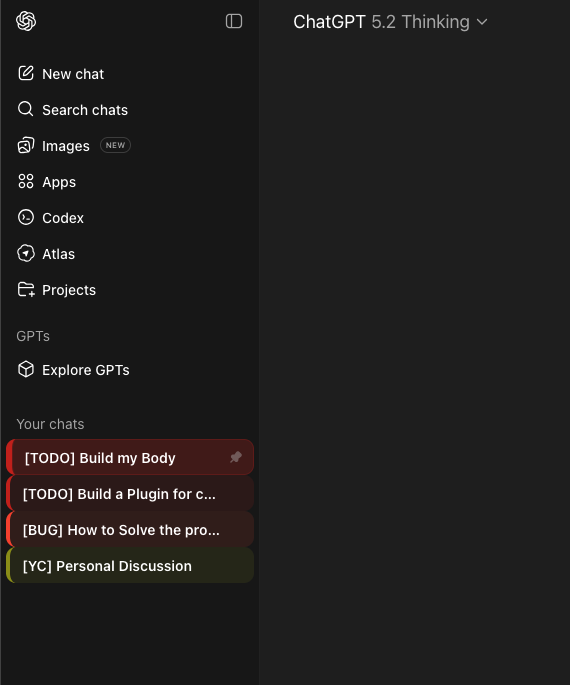
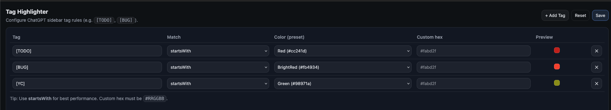

# ChatGPT Tag Highlighter

一个轻量级浏览器扩展：根据聊天标题里的标签（例如 **[TODO]**、**[BUG]**）自动高亮 ChatGPT 侧边栏会话。
效果是：**左侧彩色标柱 + 柔和背景**，让你一眼找到重要对话、快速跳转、不再“翻聊天翻到心态爆炸”。


---

## 为什么需要它

当你把 ChatGPT 当作第二大脑用久了，侧边栏会迅速变成“信息迷雾”：

- 这条是 bug 现场？还是当时的灵感？
- 那条是待办？还是已经做完的？
- 点进去一看不对又退出来……重复十次，最后直接新开一个 chat（然后更乱）

**ChatGPT Tag Highlighter** 只做一件事：
> 让你的侧边栏像“任务列表”一样可视化，有秩序、有优先级。

---

## 功能特性

-  **标签高亮**：根据标题标签高亮侧边栏会话（例如 `[TODO]`、`[BUG]`）
-  **设置页可配置**：
  - 增加/删除标签
  - 匹配方式：`startsWith`（推荐、最快）或 `includes`
  - 颜色：预置配色（Gruvbox 风格）或自定义 `#RRGGBB`
-  **选中态 vs 非选中态区分**：
  - 选中的会话更明显（更强背景 + 更粗标柱）
-  **性能优先**：
  - 只处理侧边栏会话列表
  - 增量更新（新出现/变更的才处理）
  - 批量刷新，减少 DOM 操作
-  **隐藏右侧导航栏**：加快长对话的加载速度
-  **对话轮次剪裁**：限制可见轮次数，减少 DOM 开销

---

## 截图

### 侧边栏预览


### 设置页面


---

## 安装方式

### Chrome（开发者模式）
1. 打开 `chrome://extensions`
2. 开启 **Developer mode**
3. 点击 **Load unpacked**
4. 选择项目目录（包含 `src/` 的那个文件夹）

### Firefox（临时加载，开发调试用）
1. 打开 `about:debugging#/runtime/this-firefox`
2. 点击 **Load Temporary Add-on**
3. 选择扩展输出目录（或打包后的 `xpi`）

---

## 使用方法

### 1）给聊天标题加标签
把对话标题写成这种格式即可：

- `[TODO] 修复发布脚本`
- `[BUG] Firefox 上传缺少字段`

### 2）在设置页配置规则
打开扩展的 **Options / Settings**，你可以配置：

- **Tag**：要匹配的标签（建议用 `[TAG]` 风格）
- **Match**：
  - `startsWith`：标题以标签开头才命中（最快、推荐）
  - `includes`：标题包含标签即可命中（更灵活）
- **Color**：
  - 选择预置颜色
  - 或输入自定义 `#RRGGBB`

---

## 默认规则

扩展首次安装会自动写入（seed）两条默认规则：

- **[TODO]** → Bright Yellow
- **[BUG]** → Bright Red

你可以在设置页随时修改或删除。

---

## 权限说明

- `storage`：用于在浏览器本地保存你的标签/颜色配置

站点访问（仅用于在这些页面应用样式）：
- `https://chatgpt.com/*`
- `https://chat.openai.com/*`

---

## 隐私说明

- 不收集任何数据
- 不上传任何信息到服务器
- 不做埋点/统计/分析
- 仅在本地读取“侧边栏会话标题”用于匹配高亮
- 配置仅保存在浏览器扩展存储中

---

## 常见问题

### 没有任何高亮效果？
- 确认聊天标题里确实有标签（例如 `[TODO] ...`）
- 打开设置页确认规则存在
- 设置现在实时生效 —— 无需刷新页面

### 设置页崩溃/白屏？
- 不要用 `file://...` 直接打开 `options.html`
- 必须从扩展的 **Options / Preferences** 打开（这样才有 `storage` API）

---

## 开发与测试指南

本节帮助贡献者（人类或 AI Agent）理解如何修改和测试代码。

### 架构概览

所有运行时代码在 `src/`。Chrome 和 Firefox 共享相同的 JS/HTML/CSS，但使用不同的 manifest：
- `src/manifest.chrome.json` — Chrome（Manifest V3，`service_worker`）
- `src/manifest.firefox.json` — Firefox（Manifest V3，`scripts` 数组 + gecko ID）

关键文件：
| 文件 | 职责 |
|------|------|
| `content.js` | 注入 `chatgpt.com` 的内容脚本。扫描侧边栏、应用高亮、隐藏会话、剪裁对话轮次、管理浮层。 |
| `background.js` | Service Worker。安装时初始化默认配置，迁移配置结构。 |
| `options.js` + `options.html` | 设置页。渲染标签规则，持久化配置。 |

### 数据流

所有脚本共享存储键 `tagHighlighterConfigV1`：
```json
{
  "rules": [{ "tag": "[TODO]", "match": "startsWith", "color": "#fabd2f", "hide": false }],
  "maxChatTurns": 0,
  "hideNavBar": true
}
```
- `background.js` 安装时初始化默认值并迁移
- `options.js` 读取、编辑、保存配置
- `content.js` 加载时读取配置，**并监听 `storage.onChanged` 实时更新**

### 修改代码

1. **在 `src/` 中编辑** —— 这是唯一的源码目录
2. **以未打包扩展加载 `src/`** —— Chrome 在 `chrome://extensions` 加载，Firefox 在 `about:debugging` 加载
3. **编辑后重新加载扩展**，然后刷新 ChatGPT 标签页
4. **同步到 `dist/`**：`publish.sh` 会自动处理，或手动复制：
   ```sh
   for f in content.js background.js options.js options.html options.css; do
     cp src/$f dist/chrome/$f && cp src/$f dist/firefox/$f
   done
   ```

### 添加新配置字段

添加新字段（如 `hideNavBar`）时需修改：
1. **`background.js`**：添加默认值，在 `seedOrMigrate()` 中添加迁移检查
2. **`options.html`**：添加 UI 元素（input/checkbox）
3. **`options.js`**：添加到 `els`、`DEFAULT_CFG()`、`render()`、`collectConfig()` 和 `init()` 迁移
4. **`content.js`**：在 `compileConfig()` 中处理，并确保 `storage.onChanged` 处理器能响应

### 使用 Playwright 测试

由于本项目是无构建步骤的浏览器扩展，测试通过 Playwright E2E 自动化完成：

```sh
# 初始化（仅需一次）
python3 -m venv /tmp/pw-env
source /tmp/pw-env/bin/activate
pip install playwright
playwright install chromium
```

```python
# 启动 Chrome 并加载扩展
from playwright.sync_api import sync_playwright

pw = sync_playwright().start()
ext_path = '/path/to/chatgpt-tag-highligher/dist/chrome'
profile_dir = '/tmp/pw-test-profile'

context = pw.chromium.launch_persistent_context(
    profile_dir,
    headless=False,
    args=[
        f'--disable-extensions-except={ext_path}',
        f'--load-extension={ext_path}',
        '--disable-blink-features=AutomationControlled',
    ],
    ignore_default_args=['--enable-automation'],
)

page = context.pages[0]
page.goto('https://chatgpt.com')
# ... 交互并验证
```

**关键测试模式：**

1. **通过 storage 设置配置**（在扩展页面上下文中）：
   ```js
   chrome.storage.sync.set({tagHighlighterConfigV1: config}, callback)
   ```

2. **验证高亮** —— 检查侧边栏链接的 `data-cth="1"` 属性
3. **验证隐藏** —— 检查 `data-cth-hidden="1"` 属性
4. **验证对话剪裁** —— 计数 `article[data-testid^="conversation-turn-"]` 元素
5. **验证导航栏隐藏** —— 检查 `html.cth-hide-navbar` 类名
6. **实时配置重载** —— 通过 storage 修改配置，等待 1–2 秒，无需 `page.reload()` 即可验证 DOM 更新

### 未来：自动化测试套件

| 测试项 | 操作 | 断言 |
|------|--------|-----------|
| 侧边栏高亮 | 设置规则，打开 ChatGPT | 匹配的链接有 `data-cth="1"` |
| 隐藏标签 | 设置 `hide: true` | 匹配的链接有 `data-cth-hidden="1"` |
| 实时配置重载 | 通过 `storage.onChanged` 修改配置 | DOM 无需刷新即更新 |
| 对话剪裁 | 在 100+ 轮次对话中设置 `maxChatTurns: 10` | `article` 数量 ≤ 10 |
| 导航栏隐藏 | 设置 `hideNavBar: true` | `html.cth-hide-navbar` 类名存在 |
| 设置页 | 加载设置、修改规则、保存 | storage 中配置与 UI 一致 |
| 配置迁移 | 使用旧配置（缺少字段）启动 | `background.js` 自动补全缺失字段 |

测试套件位于 `tests/`，运行方式：

```sh
python3 -m venv .venv && source .venv/bin/activate
pip install playwright pytest
playwright install chromium
pytest tests/test_extension.py -v
```

包含：
- **单元测试** (`tests/unit_test.html`) — 40+ 个断言，测试颜色转换、配置编译、规则匹配，通过 Playwright 在浏览器中运行
- **E2E 测试** (`tests/test_extension.py`) — 设置页渲染、配置持久化、保存/重置、添加/删除规则、缺失字段迁移

## License

See [License](./LICENSE)

