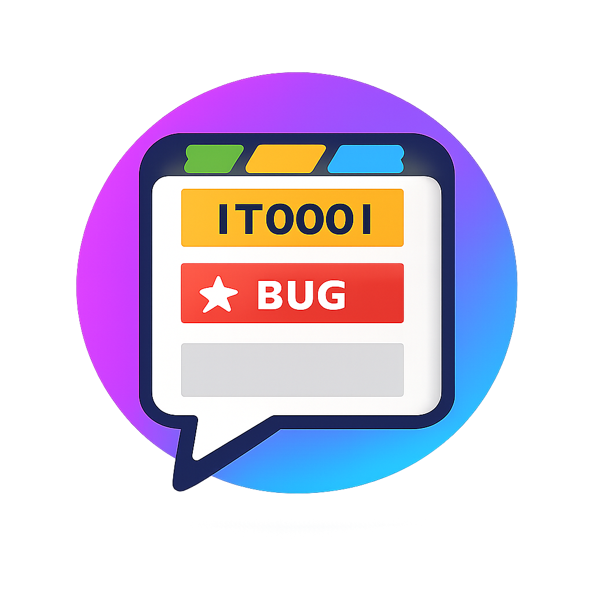
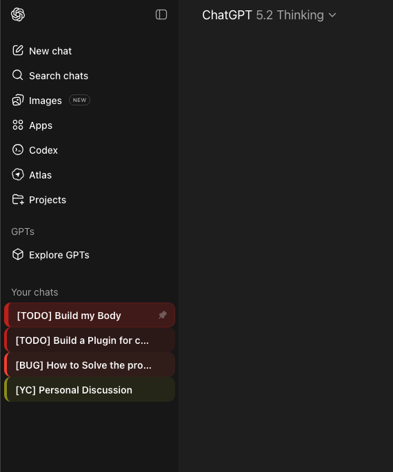
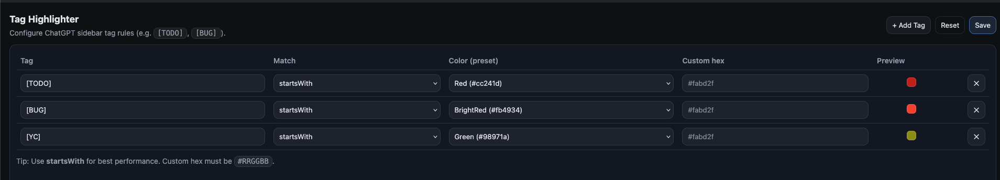

# ChatGPT Tag Highlighter

Yet, just another lightweight browser extension that highlights ChatGPT sidebar conversations based on **title tags** like **[TODO]** and **[BUG]**. 
It adds a **colored left stripe** + subtle background so tagged chats are easy to scan and jump to.

## Installation
### For Chrome: visit [ChatGPT Tag Highlighter](https://chromewebstore.google.com/detail/chatgpt-tag-highlighter/lplghggkggkbkkakjabafjenjlekogbm?authuser=0&hl=en)
### For Firefox: visit [ChatGPT Tag Highlighter](https://addons.mozilla.org/en-US/firefox/addon/chatgpt-tag-highlighter/)

---

## Why this exists

When you use ChatGPT for many ongoing tasks, the sidebar quickly becomes noisy. ChatGPT Tag Highlighter helps you:
- spot important threads instantly (**[BUG]**, **[TODO]**, etc.)
- keep debugging / notes organized without changing your workflow
- stay fast: minimal DOM work, incremental updates, low overhead

---

## Features

- **Tag-based highlighting** in the ChatGPT sidebar (e.g. `[TODO]`, `[BUG]`)
- **Configurable rules** in a Settings page:
  - add/remove tags
  - choose match type: `startsWith` (recommended) or `includes`
  - choose color from a preset palette or use a custom `#RRGGBB`
- **Selected vs. unselected styles**:
  - selected chat gets a stronger background + thicker stripe
- **Performance-first implementation**:
  - rules are compiled once
  - only processes sidebar chat items (not the whole page)
  - batches DOM updates and handles dynamic loading

---

## Screenshots

### Sidebar preview

### Settings page

---

## Installation

### Chrome (Developer Mode)
1. Open `chrome://extensions`
2. Enable **Developer mode**
3. Click **Load unpacked**
4. Select the project folder (the folder that contains `src/`)

### Firefox (Temporary Add-on for development)
1. Open `about:debugging#/runtime/this-firefox`
2. Click **Load Temporary Add-on**
3. Select the extension build output (or the Firefox package if you have one)

---

## Usage

### 1) Add tags to your ChatGPT chat titles
Name your conversations with a prefix tag, for example:
- `[TODO] Fix the build pipeline`
- `[BUG] Cosmos auth token issue`

### 2) Configure highlighting rules
Open extension **Options / Settings**, then configure:
- **Tag**: the text to match (recommended format: `[TAG]`)
- **Match**:
  - `startsWith` (fastest, recommended)
  - `includes` (more flexible, slightly slower)
- **Color**:
  - choose from preset palette
  - or enter a custom hex like `#fabd2f`

---

## Default rules

Out of the box, ChatGPT Tag Highlighter seeds these rules:
- **[TODO]** → Bright Yellow
- **[BUG]** → Bright Red

You can modify or remove them anytime in Settings.

---

## Permissions

- `storage`: saves your tag/color rules locally in the browser.

Host access:
- `https://chatgpt.com/*`
- `https://chat.openai.com/*`

---

## Privacy

- No analytics.
- No tracking.
- No data is sent to any server.
- Your configuration is stored locally using the browser’s extension storage.
- The extension reads **sidebar conversation titles** only to apply your selected styles.

---

## Troubleshooting

### Nothing is highlighted
- Make sure your chat titles actually contain the tag (e.g. `[TODO] ...`)
- Open Settings and verify rules exist
- If you changed settings, reload the ChatGPT page

### Options page crashes
- Don’t open `options.html` via `file://...`
- Open it via the extension’s **Options / Preferences** page so storage APIs are available.

## License
See [License](./LICENSE)
