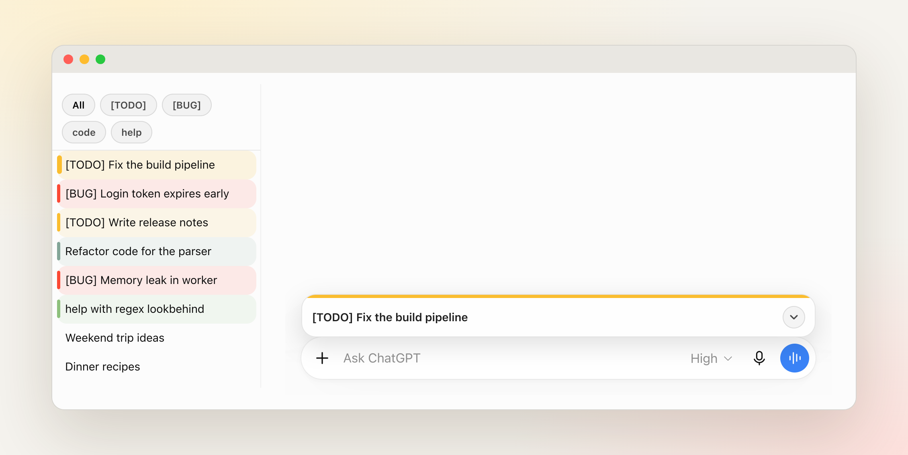
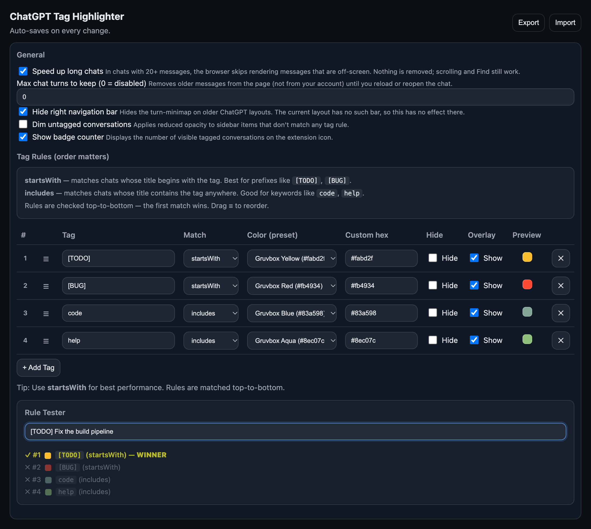
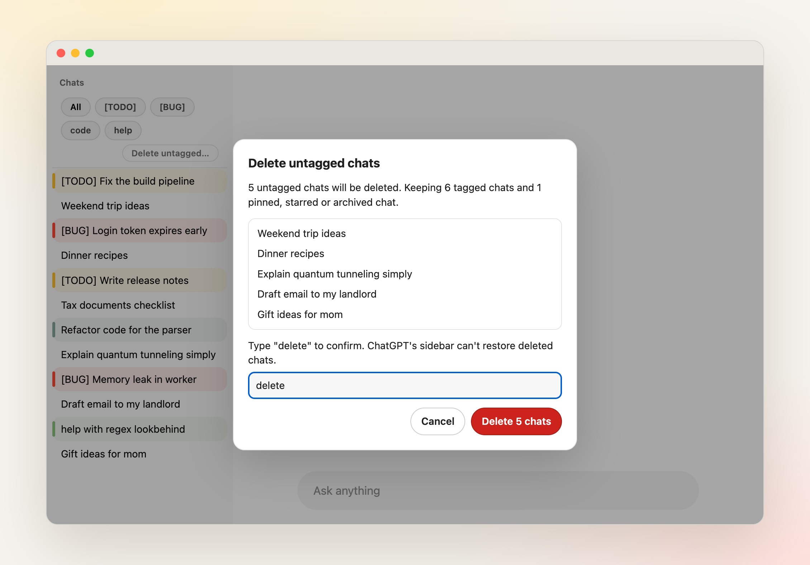

<p align="center">
  
</p>

<h1 align="center">ChatGPT Tag Highlighter</h1>

<p align="center">
  Color-code your ChatGPT sidebar with title tags like <b>[TODO]</b> and <b>[BUG]</b>,<br>
  filter by tag, and keep long conversations fast.
</p>

<p align="center">
  <a href="https://chromewebstore.google.com/detail/chatgpt-tag-highlighter/lplghggkggkbkkakjabafjenjlekogbm"><b>Chrome Web Store</b></a> ·
  <a href="https://addons.mozilla.org/firefox/addon/chatgpt-tag-highlighter/"><b>Firefox Add-ons</b></a> ·
  <a href="./ReadMe.CN.md">中文说明</a>
</p>

<p align="center">
  <a href="https://github.com/D0n9X1n/chatgpt-tag-highlighter/actions/workflows/test.yml"></a>
  <a href="https://github.com/D0n9X1n/chatgpt-tag-highlighter/actions/workflows/codeql.yml"></a>
  <a href="https://github.com/D0n9X1n/chatgpt-tag-highlighter/releases"></a>
  <a href="https://chromewebstore.google.com/detail/chatgpt-tag-highlighter/lplghggkggkbkkakjabafjenjlekogbm"></a>
  <a href="https://chromewebstore.google.com/detail/chatgpt-tag-highlighter/lplghggkggkbkkakjabafjenjlekogbm"></a>
  <a href="https://addons.mozilla.org/firefox/addon/chatgpt-tag-highlighter/"></a>
  <a href="https://addons.mozilla.org/firefox/addon/chatgpt-tag-highlighter/"></a>
  <a href="./LICENSE"></a>
</p>

<p align="center">
  <picture>
    <source media="(prefers-color-scheme: dark)" srcset="./img/hero-dark.png">
    
  </picture>
</p>

---

## What it does

- **Colors tagged chats.** Name a chat `[TODO] Fix the build pipeline` and it gets a colored stripe and background in the sidebar. The open chat gets a stronger highlight.
- **Filters by tag.** Pills above the chat list show only the tags you pick. Select several at once. Your selection survives a reload.
- **Shows where you are.** A banner above the message box shows the open chat's tag and title. Click it to jump to the latest message.
- **Keeps long chats fast.** Messages that are off-screen skip rendering. Nothing is removed, so scrolling and Find still work. [Numbers below.](#long-chats-stay-fast)
- **Clears out untagged chats (optional).** Turn it on and the filter bar gets a button that lists every chat matching no rule, then deletes them after you type `delete`. Pinned, starred and archived chats are kept. [Details below.](#deleting-untagged-chats)
- **Stays out of the way.** Rules apply live, it follows ChatGPT's light or dark theme, and it asks for no permissions beyond storage and the two ChatGPT sites.

## Quick start

1. Install from the [Chrome Web Store](https://chromewebstore.google.com/detail/chatgpt-tag-highlighter/lplghggkggkbkkakjabafjenjlekogbm) or [Firefox Add-ons](https://addons.mozilla.org/firefox/addon/chatgpt-tag-highlighter/).
2. Rename a few chats in ChatGPT so they start with a tag, for example `[TODO] …` or `[BUG] …`.
3. That's it. Four starter rules are already set up: **[TODO]**, **[BUG]**, **code**, and **help**. Open the extension's **Options** page to change them.

## Settings

<p align="center">
  
</p>

**Tag rules** are checked top to bottom, and the first match wins. Drag ≡ to reorder. Each rule has:

| Field | Meaning |
|---|---|
| Tag | The text to look for. Matching is case-sensitive. |
| Match | `startsWith`: the title begins with the tag (best for `[TAG]` prefixes). `includes`: the tag appears anywhere in the title. |
| Color | Pick a preset or enter any `#RRGGBB`. |
| Hide | Hide matching chats from the sidebar. `Alt+H` reveals them. |
| Overlay | Show the tag banner when a matching chat is open. |

The **Rule tester** tells you which rule a title would match. **Export** copies your settings as JSON and **Import** loads them back. Every change saves automatically.

**General options:**

| Option | Default | What it does |
|---|---|---|
| Speed up long chats | On | In chats with 20 or more messages, the browser skips rendering off-screen messages. The newest 4 always render. |
| Max chat turns to keep | 0 (off) | Removes older messages from the page, not from your account. They come back when you reload or reopen the chat. |
| Hide right navigation bar | On | Hides the message minimap on older ChatGPT layouts. The current layout has no minimap, so this does nothing there. |
| Dim untagged conversations | Off | Fades chats that match no rule. |
| Show badge counter | On | Shows how many tagged chats are visible on the extension icon. |
| Show “Delete untagged chats” button | Off | Adds a **Delete untagged…** button to the filter bar. See [Deleting untagged chats](#deleting-untagged-chats). |

**Keyboard shortcuts:** `Alt+H` (`Option+H` on macOS) shows or hides chats hidden by rules. `Alt+F` moves focus to the filter bar.

### Deleting untagged chats

Off by default. With **Show “Delete untagged chats” button** on, click **Delete untagged…** in the filter bar:

<p align="center">
  <picture>
    <source media="(prefers-color-scheme: dark)" srcset="./img/delete-untagged-dark.png">
    
  </picture>
</p>

1. The extension asks ChatGPT for your full chat list, not just the chats loaded in the sidebar, and lists every chat whose title matches no rule. Nothing is deleted yet.
2. Pinned, starred and archived chats are kept, and so is every chat that matches a rule, including rule-hidden ones.
3. Type `delete` and confirm. The list is checked again first, and any chat you tagged, pinned, starred, archived or deleted since the preview is skipped. Chats are then deleted one at a time with the same request ChatGPT's own **Delete** sends. **Stop** halts after the current chat, and the first error stops the run.

ChatGPT's sidebar can't restore deleted chats, so check the list before you confirm. This relies on ChatGPT's private web endpoints, which can change without notice.

## Long chats stay fast

Very long conversations get slow because the browser keeps laying out and styling every message, even ones far off-screen. With **Speed up long chats** on, older messages use `content-visibility: auto`. The browser skips them until they come near the screen. Each message keeps its measured height, so the scrollbar doesn't jump.

Measured on live ChatGPT in Chrome, in a conversation of about 200 messages, with the option off and then on:

| Work | Off | On |
|---|---:|---:|
| Style recalculation across 4 window resizes | 2,059 ms | 449 ms |
| Layout across the same resizes | 59 ms | 20 ms |
| 10 page-wide style changes (for example, theme switches) | 1,255 ms | 296 ms |
| Slowest frame while scrolling the whole thread | 120 ms | 27 ms |

These numbers come from one machine and will vary. Chats under 20 messages are left alone. The extension's own work is small: showing the overlay added under 0.1 ms per frame in the same session.

## Permissions and privacy

- **`storage`** saves your rules. It uses the browser's extension sync storage, so your browser may sync them across your signed-in devices.
- **Site access** to `https://chatgpt.com/*` and `https://chat.openai.com/*` lets it style those pages. It has no access to any other site.
- The extension reads **sidebar chat titles** to match your rules, and **message heights** to speed up long chats. It doesn't read or store message text.
- **Delete untagged chats**, if you use it, lists your chats and deletes the ones you confirm through your signed-in ChatGPT session. Those requests go only to ChatGPT. The session token stays in memory for that run and is never stored.
- No analytics, no tracking, and no servers of its own. See the [Privacy Policy](./Privacy%20Policy.md).

## Troubleshooting

- **Nothing is highlighted.** Check that the title really contains the tag. Matching is case-sensitive, and `startsWith` needs the tag at the very beginning. The rule tester in Options will tell you. Rule changes apply without a reload.
- **The Options page is blank.** Open it from the extension's Options entry, not as a `file://` path, so the storage APIs are available.
- **ChatGPT changed its layout and something broke.** Please [open an issue](https://github.com/D0n9X1n/chatgpt-tag-highlighter/issues) with your browser version.

## Development

The extension is plain JavaScript with no dependencies and no bundler. `src/` holds the source and two manifest templates but no `manifest.json`, so build before loading:

```sh
./publish.sh --version 0.0.99            # writes dist/chrome/, dist/firefox/, .zip and .xpi
```

- **Chrome:** open `chrome://extensions`, turn on Developer mode, click **Load unpacked**, and choose `dist/chrome/`.
- **Firefox:** open `about:debugging#/runtime/this-firefox`, click **Load Temporary Add-on**, and choose `dist/firefox/manifest.json`.

Rebuild after each edit, reload the extension, then refresh the ChatGPT tab.

<details>
<summary><b>Tests, architecture, and live-testing rules</b></summary>

```sh
python3 -m venv .venv && source .venv/bin/activate
pip install -r tests/requirements.txt && playwright install chromium

./publish.sh --version 0.0.99                     # tests run against dist/chrome
CI=true pytest tests/test_extension.py -v         # full suite, disposable browser profile
CI=true pytest tests/test_extension.py -k TestContentScript -v
for f in src/*.js; do node --check "$f"; done     # syntax check
npx --yes web-ext@8.3.0 lint --source-dir dist/firefox --warnings-as-errors=false --self-hosted
```

- `TestContentScript` runs the **packaged** content script against realistic mock ChatGPT pages served at `https://chatgpt.com/`. Other tests cover the options page, migrations, and import/export.
- `background.js` sets up and migrates the config. `options.js` edits it. `content.js` applies it and updates live on `storage.onChanged`. They all share the storage key `tagHighlighterConfigV1`. The filter selection is stored separately under `tagHighlighterUiStateV1`, in local storage.
- A new config field has to default safely in all three scripts.
- **Live testing on chatgpt.com:** leave `tests/.test-profile/` alone. It holds a login. Use one browser session for the whole run, because ChatGPT's cookies are short-lived. Never send, create, rename, or delete chats.

For more, see [CONTRIBUTING](./.github/CONTRIBUTING.md) and [CLAUDE.md](./CLAUDE.md), which lists the ChatGPT page elements the extension relies on.
</details>

## License

[MIT](./LICENSE)
