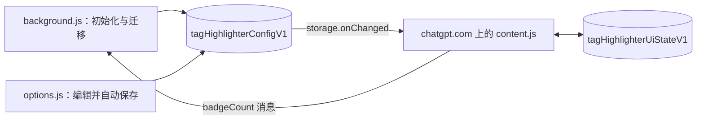

# 架构

[English](Architecture)

## 脚本

扩展是写在 IIFE 中的纯 JavaScript，没有依赖，也没有打包工具。

| 脚本 | 职责 |
|---|---|
| `background.js` | 安装/启动时初始化并迁移设置；根据 `badgeCount` 消息设置图标角标（全局一个角标）。 |
| `options.js` | 渲染和编辑规则与选项；每次修改都保存完整配置。 |
| `content.js` | 在 ChatGPT 上运行；编译配置、给侧边栏加样式、显示横幅，处理筛选、快捷键、轮次剪裁和长对话渲染。 |

## 存储

- `tagHighlighterConfigV1`：规则和选项。优先从 `storage.sync` 读取，回退到 `storage.local`。
- `tagHighlighterUiStateV1`：选中的筛选标签，仅保存在 `storage.local`，并有 400 ms 防抖，因此不会与设置页的写入或同步配额冲突。

新增配置字段必须在三个脚本中都有安全的默认值。颜色始终以 `#rrggbb` 保存。

## ChatGPT 页面钩子

ChatGPT 会不打招呼地改动页面。内容脚本依赖：

- **侧边栏：** `#history` → `a[data-sidebar-item="true"]`，标题在 `.truncate span[dir="auto"]` 中。打开的会话带有空的 `data-active` 属性；`data-active="false"` 不算选中。
- **输入框：** `#prompt-textarea` 位于 `form[data-type="unified-composer"]` 中，旧布局回退到 `div.bg-token-bg-primary`。横幅以它为定位基准。
- **消息：** `[data-testid="conversation-turn-N"]`，现在是 `<section>`（以前是 `<article>`）。真正的滚动容器是 `<main>` 之上的一个 `overflow-y: auto` 元素。
- **ChatGPT 的"滚动到底部"按钮：** 一个没有标签、`aria-hidden` 的按钮，位于 class 中含 `data-scroll-from-end` 的容器内。

ChatGPT 改版后，先根据检查到的页面结构（绝不使用真实标题或消息）更新测试夹具，写一个会失败的测试，再修复。见 [测试](Testing-zh-CN)。

## 生命周期

- DOM 操作通过 `requestAnimationFrame` 调度器批量处理，`WeakMap` 标题缓存会跳过未变化的会话。
- 侧边栏观察器监听 `#history` 中的新会话、标题文字和选中变化。页面级观察器在 `#history` 被替换、移除或延迟挂载时重新绑定，包括首次安装时设置晚于页面到达的情况。
- 消息观察器只在开启轮次剪裁或长对话渲染时运行。
- 横幅把"需要显示"（打开的会话命中规则）和"已显示"（输入框可测量）分开跟踪，因此 ChatGPT 重新挂载输入框后能恢复。
- 内容脚本运行在隔离环境中，看不到 ChatGPT 自己的 `history.pushState` 调用，所以依赖 DOM 观察器。扫描时不能写入侧边栏观察器监听的属性，以免形成变更循环。
