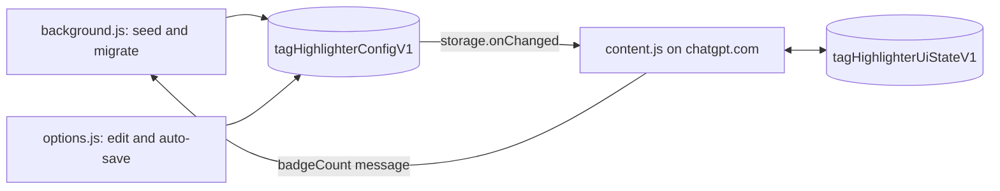

# Architecture

[简体中文](Architecture-zh-CN)

## Scripts

The extension is plain JavaScript in IIFEs, with no dependencies or bundler.

| Script | Role |
|---|---|
| `background.js` | Seeds and migrates the settings on install/startup; sets the icon badge from `badgeCount` messages (one global badge). |
| `options.js` | Renders and edits rules and options; saves the whole config on every change. |
| `content.js` | Runs on ChatGPT; compiles the config, styles the sidebar, shows the banner, handles filters, shortcuts, pruning and long-chat rendering. |

## Storage

- `tagHighlighterConfigV1`: rules and options. Read from `storage.sync`, falling back to `storage.local`.
- `tagHighlighterUiStateV1`: selected filter pills, in `storage.local` only, saved with a 400 ms debounce so it never competes with options-page writes or sync quotas.

A new config field must default safely in all three scripts. Colors are always saved as `#rrggbb`.

## ChatGPT page hooks

ChatGPT changes its page without notice. The content script depends on:

- **Sidebar:** `#history` → `a[data-sidebar-item="true"]`, title in `.truncate span[dir="auto"]`. The open chat has an empty `data-active` attribute; `data-active="false"` is not selected.
- **Message box:** `#prompt-textarea` inside `form[data-type="unified-composer"]`, with `div.bg-token-bg-primary` as the legacy fallback. The banner is positioned against it.
- **Messages:** `[data-testid="conversation-turn-N"]`, now `<section>` (formerly `<article>`). The real scroller is an `overflow-y: auto` element above `<main>`.
- **ChatGPT's scroll-to-bottom button:** an unlabelled, `aria-hidden` button inside a wrapper whose class contains `data-scroll-from-end`.

When ChatGPT changes, update the test fixture from the inspected page structure (never real titles or messages), add a failing test, then fix. See [Testing](Testing).

## Lifecycle

- DOM work is batched through `requestAnimationFrame` schedulers, and a `WeakMap` title cache skips unchanged chats.
- A sidebar observer watches `#history` for new chats, title text, and selection changes. A page-level observer rebinds when `#history` is replaced, removed, or mounted late, including when settings arrive after the page on first install.
- The message observer only runs while pruning or long-chat rendering is on.
- The banner tracks "wanted" (the open chat matches) separately from "shown" (a message box is measurable), so it recovers when ChatGPT re-mounts the message box.
- The content script runs in an isolated world and can't see ChatGPT's own `history.pushState` calls, so it relies on DOM observers. Scans must not write attributes the sidebar observer watches, to avoid mutation loops.
